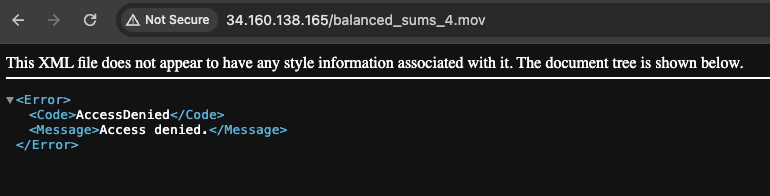

Verify infrastructure changes using the ``gcloud`` CLI
======================================================

| After applying your Terraform configuration changes, you can verify
  each component using the gcloud CLI by executing specific commands for
  each resource.
| This document is only an example for specific configurations.
| For other configurations, refer to the official documentation or a
  fact-checked GenAI conversation.

1. Verify the GCS Bucket
~~~~~~~~~~~~~~~~~~~~~~~~

Check if the static content bucket is created and list its details:

.. code:: sh

   gcloud storage buckets describe your-bucket-name

Replace ``your-bucket-name`` with the name of your GCS bucket. This
command outputs details about the bucket, including its location,
storage class, and IAM policy.

2. Verify Service Account Access to the GCS Bucket
~~~~~~~~~~~~~~~~~~~~~~~~~~~~~~~~~~~~~~~~~~~~~~~~~~

To check the IAM policy bindings of the bucket and verify that the
service account has the correct access:

.. code:: sh

   gcloud storage buckets get-iam-policy your-bucket-name

Look for the ``roles/storage.objectViewer`` role associated with your
service account
``professional-portfolio-sa@${var.project_id}.iam.gserviceaccount.com``
in the output.

3. Verify the Backend Bucket for Cloud CDN
~~~~~~~~~~~~~~~~~~~~~~~~~~~~~~~~~~~~~~~~~~

List all backend buckets to find the one used for Cloud CDN:

.. code:: sh

   gcloud compute backend-buckets list

Then, get more details about your backend bucket, including whether CDN
is enabled:

.. code:: sh

   gcloud compute backend-buckets describe cdn-backend-bucket

Replace ``cdn-backend-bucket`` with your backend bucket’s name.

4. Verify the External HTTP(S) Load Balancer
~~~~~~~~~~~~~~~~~~~~~~~~~~~~~~~~~~~~~~~~~~~~

To verify the load balancer, first list all URL maps to find yours:

.. code:: sh

   gcloud compute url-maps list

Then, describe your URL map for more details:

.. code:: sh

   gcloud compute url-maps describe url-map-name

Replace ``url-map-name`` with the name of your URL map. This will give
you details about the load balancer’s frontend configuration and the
backend service or bucket it’s connected to.

5. Verify Cloud CDN
~~~~~~~~~~~~~~~~~~~

Verifying Cloud CDN involves checking if it’s enabled on your backend
bucket. This information was obtained in step 3, but you can also verify
cache hits and misses through Cloud Monitoring or by analyzing access
logs if you have them enabled for your GCS bucket.

--------------

Verify object uploads to static content bucket(s)
~~~~~~~~~~~~~~~~~~~~~~~~~~~~~~~~~~~~~~~~~~~~~~~~~

If access to static content is restricted to only a specific service
account, direct access to the object via the load balancer URL will
result in a 403 status code:

For example, when attempting to access the URL
``http://34.160.138.165/my_object.mov`` you would see something like:

   403 status code

| To test static content uploads locally in this scenario, use signed
  URLs.
| A signed URL provides temporary access to a private object through a
  generated URL. You can use ``gsutil`` or a Google Cloud client library
  to generate a signed URL for your object.

First, ensure you have a service account key file for your app’s service
account (e.g., ``professional-portfolio-sa``). Then, use the following
``gsutil`` command:

.. code:: shell

   gsutil signurl -d [DURATION]h [SERVICE_ACCOUNT_KEY_FILE].json gs://[BUCKET_NAME]/[OBJECT_NAME]

This will generate a signed URL you can use to verify that the service
account can reach the content once the app is deployed.

--------------

Additional Notes:
~~~~~~~~~~~~~~~~~

-  Ensure you’re authenticated with the ``gcloud`` CLI and set to the
   correct project using ``gcloud config set project your-project-id``.
-  Replace placeholder values like ``your-bucket-name``,
   ``cdn-backend-bucket``, and ``url-map-name`` with the actual names
   used in your Terraform configuration.
-  The verification steps above assume you have the necessary
   permissions to view these resources and their configurations in your
   GCP project.

You can use the ``gcloud`` CLI, Terraform, or the Google Cloud console
to delete the load balancer(s) and GCS bucket(s).

Using these ``gcloud`` CLI commands, you can effectively verify the
setup and configuration of your GCS bucket, backend bucket for Cloud
CDN, external HTTP(S) load balancer, and the correct IAM permissions for
your service account.
